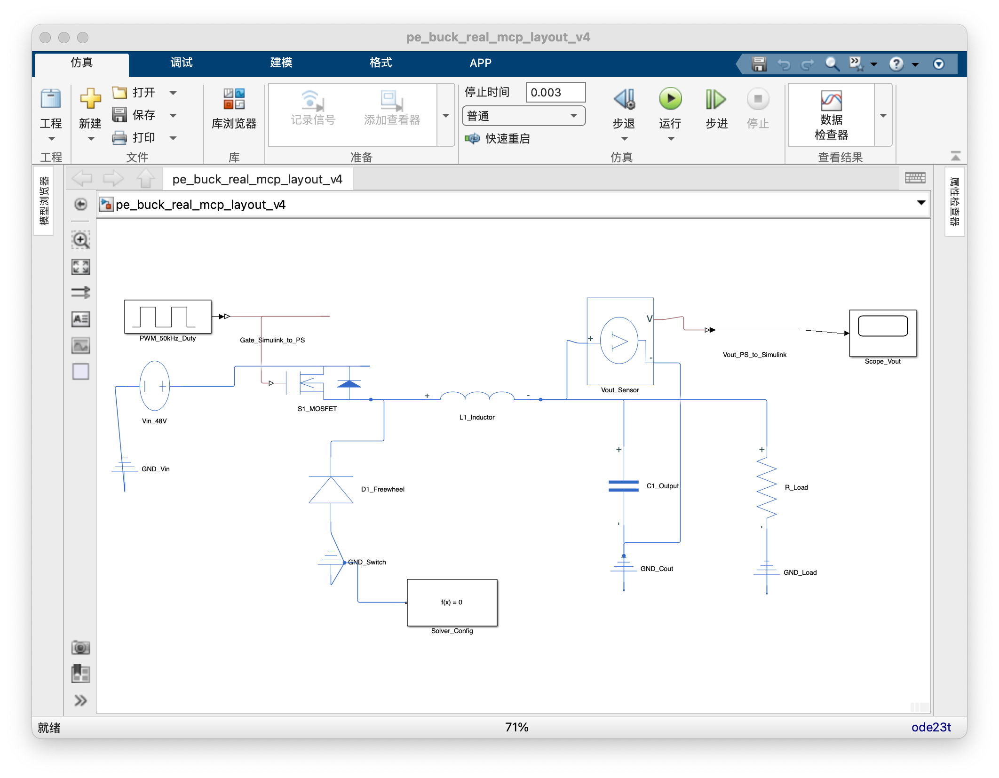

# Simulink Power Electronics Skill

`simulink-power-electronics` is a Codex skill for Simulink and Simscape
Electrical power-electronics work. It adds PE-specific routing, inspection,
layout, debugging, and validation rules on top of the official MathWorks
Simulink skills.

中文摘要：这是一个面向 Simulink/Simscape Electrical 电力电子模型的
Codex Skill。它负责领域分类、模型检查、波形/门极调试、Simscape
原理图布局规则和仿真验证证据管理。

## What It Does

- Classifies PE models by domain and topology.
- Guides model inspection before edits: solver settings, variants, From/Goto
  paths, plant/control split, measurement polarity, and generated artifacts.
- Provides active three-phase inverter SVPWM/gate-routing diagnostics.
- Adds grid-inverter control-algorithm tracing for VSG, PI/feedforward issues,
  and P/Q coefficient checks.
- Provides developing DC-DC and motor-drive inspection guidance.
- Captures Simscape Electrical schematic layout rules learned from official and
  open-source examples.
- Tracks validation state as `opened`, `compiled`, `simulated`, and `measured`.

It does not manage OS-level schedulers, background jobs, or general Codex
automation orchestration.

The root skill is intentionally thin. It routes to one domain subskill and one
or two references instead of loading the whole repository into context.

## Quick Use

Install or copy this folder as a Codex skill, restart Codex, then invoke it with
`$simulink-power-electronics` when reviewing, editing, generating, or validating
Simulink power-electronics models.

With the Codex skill installer:

```text
$skill-installer install https://github.com/npuzsy/simulink-power-electronics
```

## Layout Guidance Example

Generated Simscape Electrical models should be drawn as readable schematics, not
generic graph layouts. For DC-DC converters, the skill now requires node-first
layout: identify `VIN_POS`, `SW`, `VOUT_POS`, and `RETURN`; place the power
path before control/measurement; keep high-degree common nodes local.

The Buck converter below was generated after applying those rules. The v4 model
compiled and completed a 3 ms simulation with `ode23t`.



## Repository Structure

```text
simulink-power-electronics/
├── SKILL.md
├── agents/
├── assets/
│   └── images/
├── references/
├── scripts/
└── subskills/
    ├── three-phase-grid-inverter/
    ├── dc-dc-converters/
    ├── motor-drives/
    └── ...
```

## Important References

- `references/domain-map.md`: choose the right PE subskill.
- `references/workflow.md`: inspect, diagnose, edit, validate.
- `references/model-standards.md`: PE model editing standards.
- `references/layout-patterns-from-examples.md`: layout rules learned from
  local official/open-source example analysis.
- `references/simscape-layout.md`: Simscape Electrical schematic layout rules.
- `references/capability-map.md`: current capability boundary.

## Subskill Status

| Subskill | Status | Scope |
| --- | --- | --- |
| `three-phase-grid-inverter` | active | SPWM/SVPWM, three-level inverter gate routing, waveform balance, VSG/control tracing |
| `dc-dc-converters` | developing | Buck/boost/buck-boost, regulation evidence, schematic layout |
| `motor-drives` | developing | PMSM/BLDC/induction drive inspection and control-path tracing |
| others | stub | Scope markers and evidence checklists |

## Toolchain

Required for real model work:

- MATLAB R2023a or later
- Simulink
- MATLAB MCP Core Server
- Simulink Agentic Toolkit

Required when the model uses physical electrical networks:

- Simscape
- Simscape Electrical

Recommended companion skills:

- Simulink Agentic Toolkit or model-based-design skills for generic build,
  edit, simulate, and test mechanics

Platform notes:

- macOS and Linux are the cleanest targets for current MCP workflows.
- Windows can work, but MCP subprocess environment and socket/file permission
  issues are more common. See `references/mcp-simulink-troubleshooting.md`.
- If MATLAB MCP or Simulink Agentic Toolkit tools are unavailable, this skill
  should report a tooling gap instead of pretending to inspect or validate
  Simulink models.

## Validation

Run repository checks:

```bash
python3 scripts/validate_skill_structure.py --quiet
python3 subskills/three-phase-grid-inverter/scripts/print_table7_state_vectors.py --format json
```

Generated corpora, downloaded examples, Simulink caches, and visual demo models
belong under ignored paths such as `data/`, `slprj/`, and `*.slxc`.

## License

Apache License 2.0. See [LICENSE](LICENSE).
